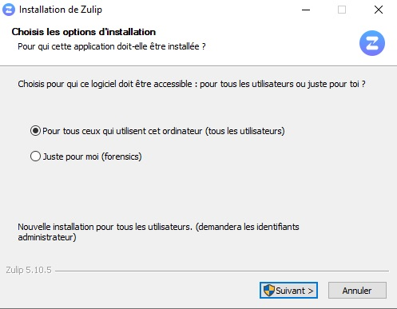
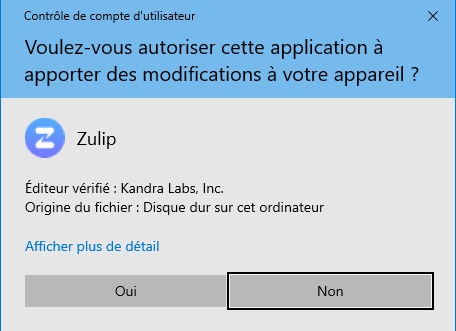
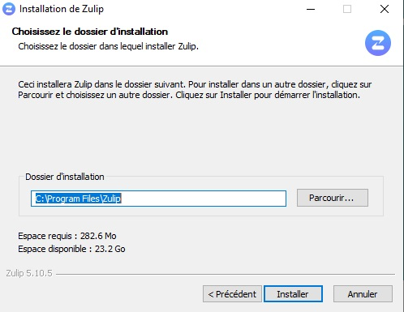
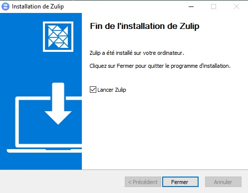

# Implémentation d'un serveur de messagerie instantanée (chat)


## **Sommaire**

1. Pré-requis techniques

2. Installation et Configuration : Les étapes pas à pas

3. FAQ

## **1. Pré-requis techniques**

## **2. Installation et Configuration : Step by Step**

### **Installation sur le serveur _Debian SRVLX01_**

### **Installation sur les clients**

#### **Installation sur le Client _Ubuntu CLILIN01_**

Une fois connecté au Client Linux, ouvrez le Terminal de commande.

Il vous faut dans un premier temps installer _snap_ sur votre client.

```
sudo apt update
sudo apt install snapd
```

Vous pouvez ensuite procéder à l'installation de _zulip_ via la commande.

```
sudo snap install zulip
```

Vous pourrez démarrer Zulip :
* Depuis le menu des applications Ubuntu
* Depuis le terminal via la commande `zulip`

Le logiciel de messagerie **Zulip** est désormais installé et opérationnel pour l'utilisateur. Il restera toutefois à l'utilisateur d'effectuer la configuration lors de sa première connexion (voir USER_GUIDE.md).

#### **Installation sur le Client _Windows CLIWIN02_**

Depuis le Client Windows, rendez-vous sur la page de téléchargement de Zulip : [Download Zulip for Windows](https://zulip.com/apps/).

Téléchargez l'éxécutable et lancez-le pour installer le logiciel sur le Client.

Lors de l'instalation, sélectionnez les options suivantes :

Sélectionnez _Pour tous ceux qui utilisent l'ordinateur (tous les utilisateurs)_ puis cliquez sur _Suivant_.



NB. Ainsi, tous les utilisateurs ayant accés à ce Client pourront bénéficier de l'expérience de Zulip.

Autorisez l'application à apporter des modifications à votre appareil.



Laissez le dossier de destination par défaut : `C:\Program Files\Zulip` puis cliquez sur _Installer_.



Une fois l'installation terminée, vous pouvez quitter en cliquant sur _Fermer_, il n'est pas obligatoire de lancer Zulip à la fin de l'installation.



## **3. FAQ**
