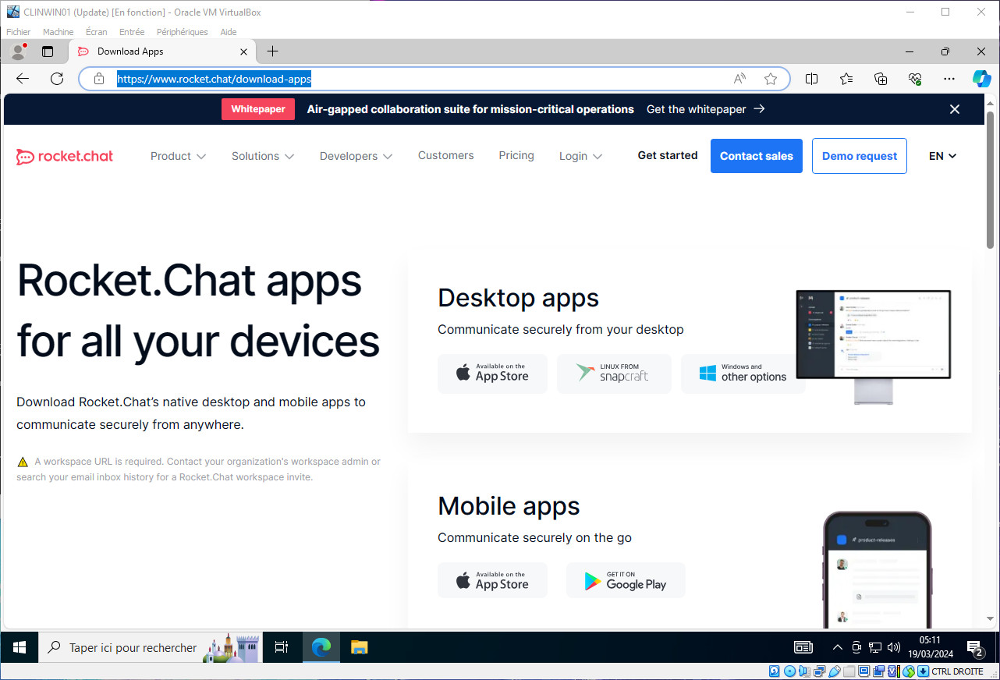
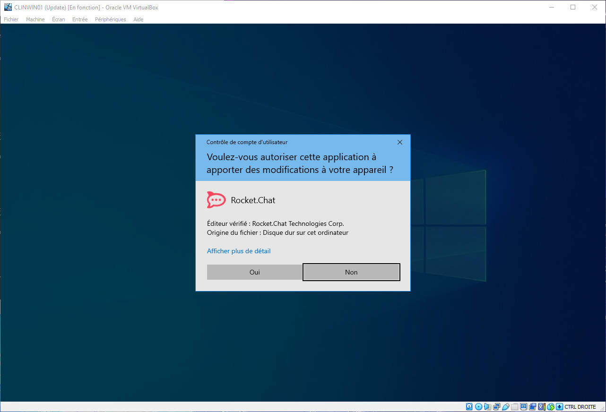
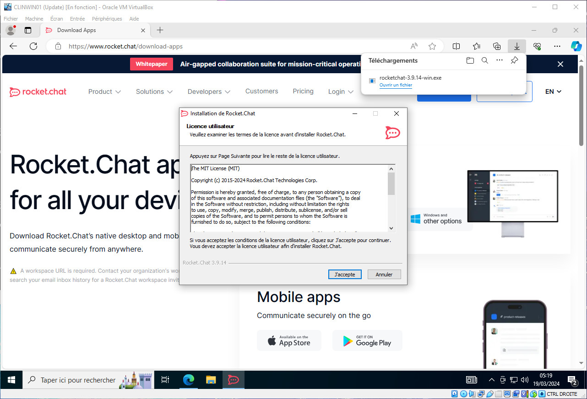
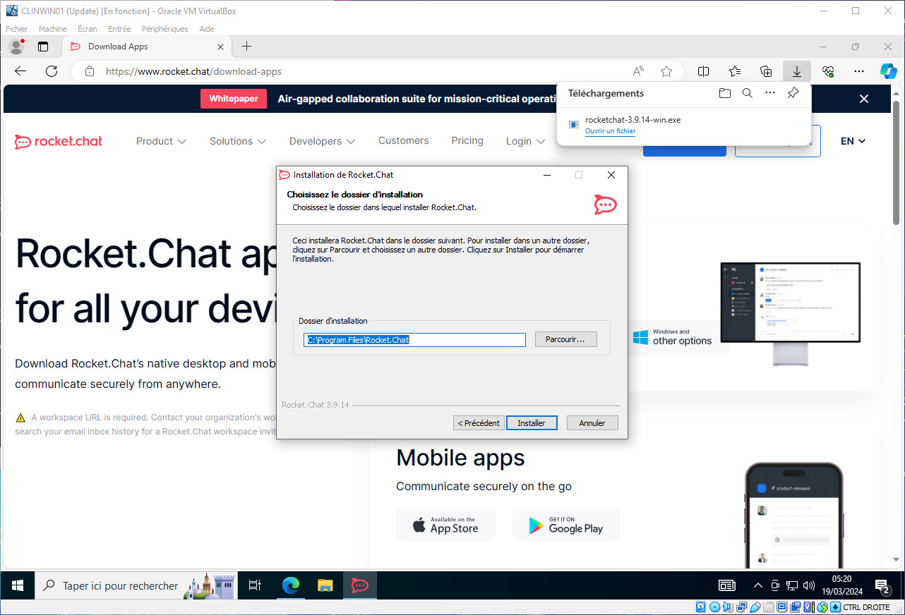
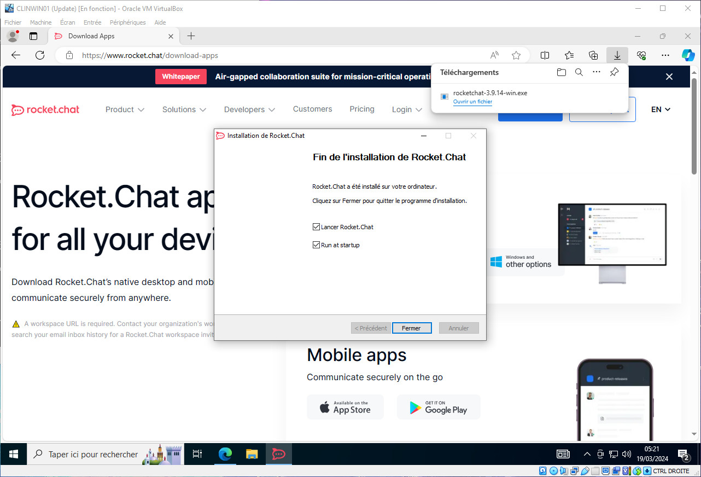
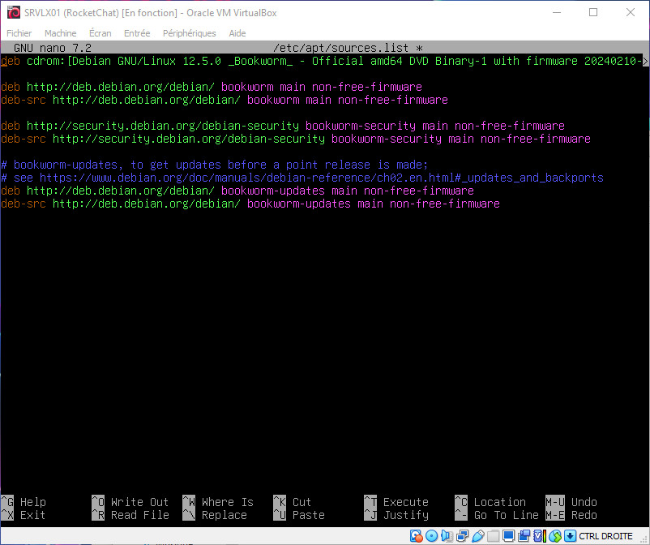
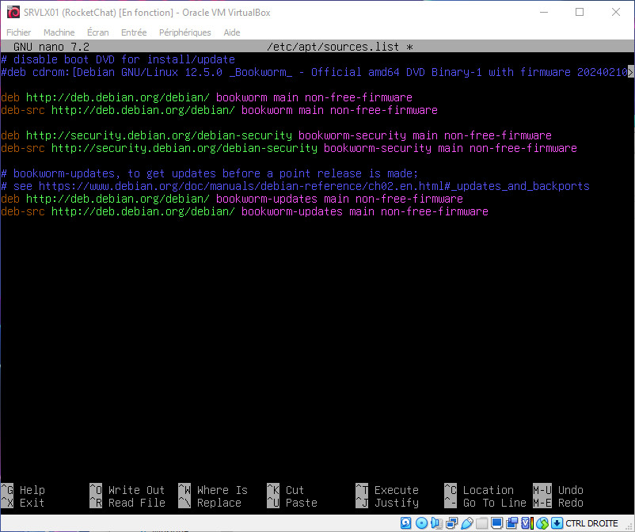

# Implémentation d'un serveur de messagerie instantanée (chat)

Ce document est réservé à usage interne, il ne peut en aucun cas être divulgué à des tiers.

Dernière mise à jour du Document : **19 mars 2024**

## **Sommaire**

1. Pré-requis techniques

2. Installation et Configuration : Les étapes pas à pas

3. FAQ

## **1. Pré-requis techniques**

Le Serveur est sous Debian 12.5.
- Nom : SRVLX01
- Compte : root
- Mot de passe : Azerty1*
- Adresse IP fixe : 172.16.10.10/24

Les clients sont respectivement sous OS Windows 10 (client 1) Ubuntu 22.04 LTS (client 2).

Pour le client Windows 10 : 
- Nom : CLIWIN01
- Compte utilisateur : wilder (dans le groupe des admins locaux)
- Mot de passe : Azerty1*
- Adresse IP fixe : 172.16.10.20/24

Pour le client Ubuntu 22.04 LTS :
- Nom :  CLILIN02
- Même compte avec même mot de passe
- Adresse IP fixe : 172.16.10.30/24

## **2. Installation et Configuration : Step by Step**

### **Installation sur le serveur _Debian 12.5_ SRVLX01**

Dans un premier temps, nous allons nous assurer que le système est à jour `apt update && apt upgrade -y`

Afin de pouvoir installer la version _serveur_ de **_Rocket.Chat_**, nous devons installer snapd puis core

`apt install snapd`

Il se peut que vous rencontriez une erreur lors de l'install de snap, si le système cherche à interroger le lecteur cdrom.
Dans ce cas, référez-vous à la question concernant ce souci dans la FAQ

Une fois cette installation terminé, nous allons installé core

`snap install core`

Et pour terminer, l'installation de **_Rocket.Chat_** version serveur

`snap install rocketchat-server`

A la fin de cet installation, un petit _reboot_ et votre serveur **_Rocket.Chat_** sera opérationnel

`reboot`

### **Installation sur les clients**

#### **Installation sur le Client _Windows 10 Pro 22H2_ CLIWIN01**

Depuis le Client Windows, rendez-vous sur la page de téléchargement de **_Rocket.Chat_** : [Download RocketChat for Windows](https://www.rocket.chat/download-apps).

Téléchargez l'éxécutable et lancez-le pour installer le logiciel sur le Client.

Lors de l'instalation, sélectionnez les options suivantes :

Cliquez sur _J'accepte_ après avoir examiner les termes de la licence

Sélectionnez _Pour tous ceux qui utilisent l'ordinateur (tous les utilisateurs)_ puis cliquez sur _Suivant_.

NB. Ainsi, tous les utilisateurs ayant accés à ce Client pourront bénéficier de l'expérience de **_Rocket.Chat_**.

Autorisez l'application à apporter des modifications à votre appareil.

Il vous faut à nouveau cliquer sur _J'accepte_ les termes de la licence

Laissez le dossier de destination par défaut : `C:\Program Files\Rocket.Chat` puis cliquez sur _Installer_.

Une fois l'installation terminée, vous pouvez quitter en cliquant sur _Fermer_, il n'est pas obligatoire de lancer le logiciel à la fin de l'installation.
En revanche, laissez cocher l'option `Run at startup`, ceci permettras à l'application de se lancer au démarrage de Windows

Le logiciel de messagerie **_Rocket.Chat_** est désormais installé et opérationnel pour l'utilisateur. Il restera toutefois à l'utilisateur d'effectuer la configuration lors de sa première connexion (voir USER_GUIDE.md).

#### **Installation sur le Client _Linux Ubuntu 22.04 LTS_ CLILIN02**

Une fois connecté au Client Linux, ouvrez le Terminal de commande.

Une petite mise à jour ne fait jamais de mal.

`sudo apt update && sudo apt upgrade -y`

Il vous faut dans un premier temps installer _snap_ sur votre client.

`sudo apt install snapd`

Vous pouvez ensuite procéder à l'installation de **_Rocket.Chat_** via la commande.

`sudo snap install rocketchat-desktop`

Vous pourrez démarrer **_Rocket.Chat_** :
* Depuis le menu des applications Ubuntu
* Depuis le terminal via la commande `rocketchat-desktop`

Le logiciel de messagerie **_Rocket.Chat_** est désormais installé et opérationnel pour l'utilisateur. Il restera toutefois à l'utilisateur d'effectuer la configuration lors de sa première connexion (voir USER_GUIDE.md).

## **3. FAQ**

1. Comment gère t'on l'administration du serveur ?
    >
    >L'administration se fait via un compte utilisateur ayant des droits spécifiques d'Administration, directement dans l'interface logiciel.
    >

2. J'ai une erreur en lien avec le lecteur DVD ou le CDRom lors de l'installation de snap
    >
    >Vous devez dans ce cas allez modifier le fichier manuellement
    >
    >Pour ce faire, vous devrez lancer la commande
    >
    >`nano /etc/apt/sources.list`
    >
    >et modifier le fichier comme suit en désactivant la première ligne, un commentaire supplémentaire est le bienvenu.
    >
    >
    >
    >
    >
    >Sauvegarder votre fichier après l'avoir éditer avec `CTRL + O` puis `Entrée` et quitter l'éditeur de texte `CTRL + X`
    >
    >Relancez l'installation de snap
    >

3. Je rencontre un souci en lien avec le processeur lors de l'installation de la version serveur de **_Rocket.Chat_**
    >
    >Il arrive parfois que votre configuration ne supporte pas la dernière version
    >
    >Veuillez dans ce cas passer par la commande `snap install rocketchat-server --channel 4.x/stable` à la place de la commande basique pour l'installation.
    >