# Implémentation d'un serveur de messagerie instantanée (chat)

Ce document est réservé à usage interne, il ne peut en aucun cas être divulgué à des tiers.

Dernière mise à jour du Document : **20 mars 2024**

## **Sommaire**

1. Démarrage et première connexion

2. Découvrir les fonctionnalités de **_Rocket.Chat_**

3. Améliorer votre expérience en personnalisant les options

4. Administration du serveur intégrée dans le logiciel

5. FAQ

## **1. Démarrage et première connexion**

Vous disposez désormais du logiciel **_Rocket.Chat_** pour interagir avec vos collaborateurs et mener à bien vos différents projets.

Nous allons vous expliquer dans les étapes suivantes, le lancement du logiciel, ainsi qu'un accompagnement pour votre première connexion.

### **Démarrage sous Ubuntu (Linux)**

Vous pouvez accéder au logiciel **_Rocket.Chat_** via le Menu des applications

Vous pourrez ajouter **RocketChat** à vos _Favoris_ (Clic droit, puis Ajouter aux Favoris), afin que celui-ci apparaisse sur le côté droit de votre bureau.

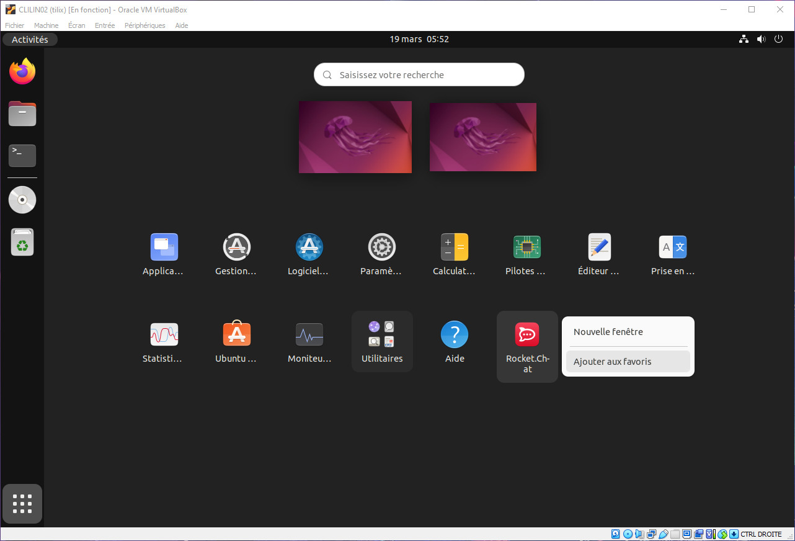

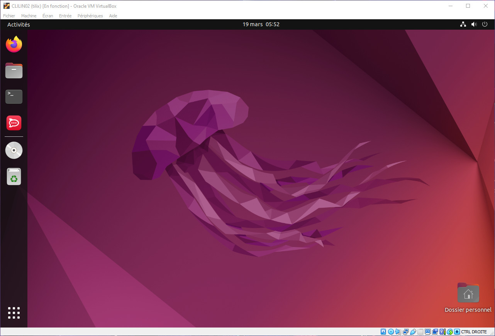

### **Démarrage sous Windows (Microsoft)**

Vous pouvez accéder au logiciel **_Rocket.Chat_**

Soit via le raccourci créé sur le bureau de travail

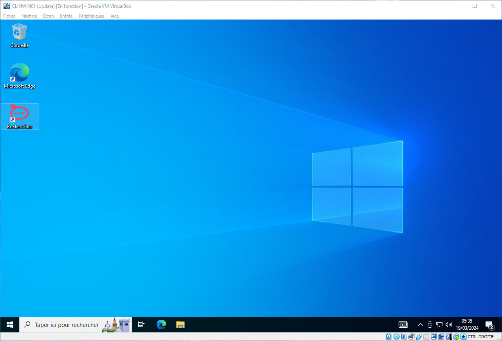

Soit en saisissant le nom du logiciel dans la barre de recherche Windows

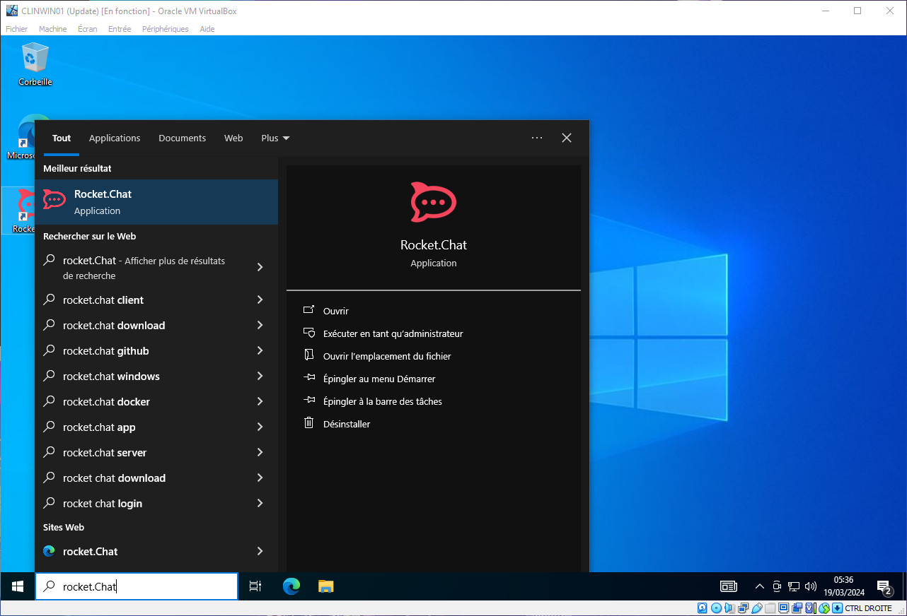

Vous n'avez plus qu'à finaliser votre première connexion pour profiter pleinement de **_Rocket.Chat_**.

Sachez également que **_Rocket.Chat_** est disponible en version web, vous pouvez vous y rendre en vous connectant avec l'url de l'organisation (<http://172.16.10.10:3000>)

### **Première connexion**

Les étapes de première connexion sont identiques aux deux Systèmes d'exploitation _Ubuntu_ & _Windows_.
Il n'y aura par conséquent qu'une méthode expliquée. L'interface graphique de **_Rocket.Chat_** étant très proche entre les deux OS

Une fois l'application démarrée, vous devrez ajouter l'url du serveur

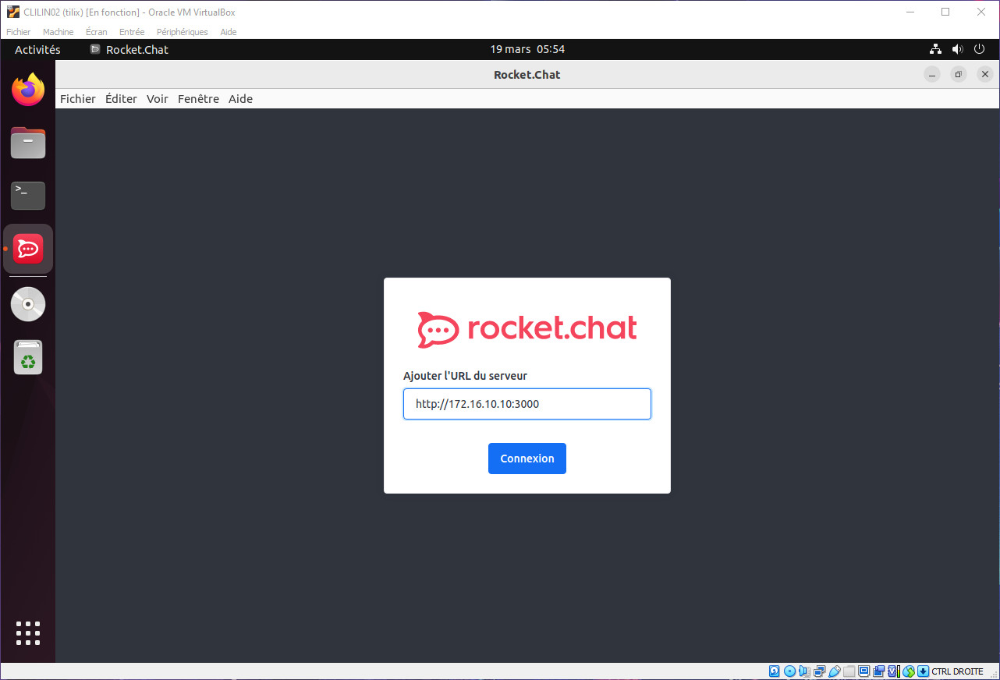

Puis cliquez sur _Connexion_ pour arriver à la page de connexion utilisateur

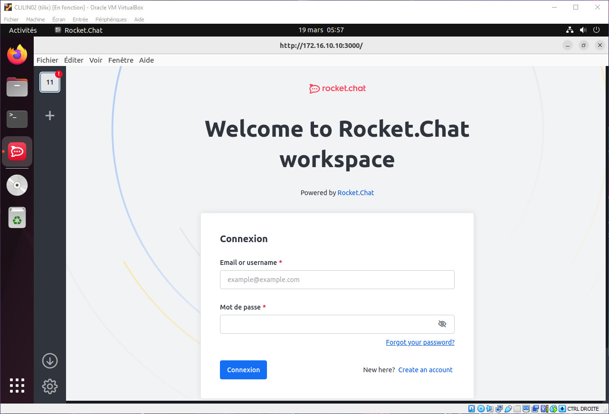

A cette étape, si vous ne possédez pas de compte, vous pouvez en créer un, en cliquant sur _Create an account_
Remplissez les champs nécessaires : _Nom_, _E-mail_, _Nom d'utilisateur_, _Mot de passe_ et _Confirmation de Mot de passe_, puis cliquez sur _Join your team_

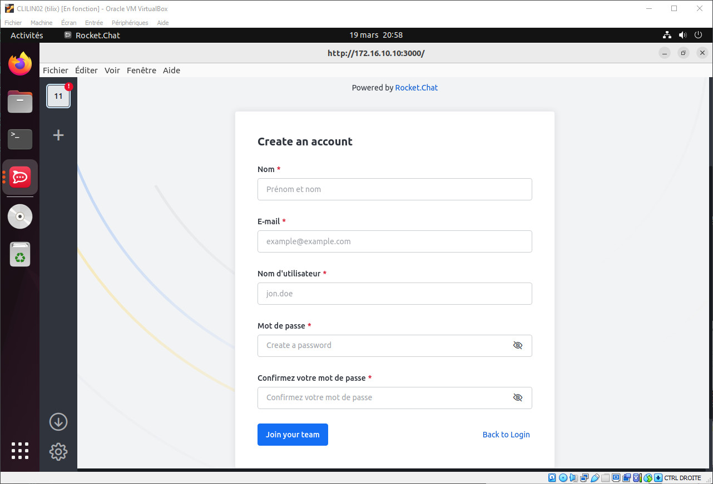

Dans le cas où votre compte est déjà créé, remplissez les champs _Email or username_, _Mot de passe_ puis cliquez sur _Connexion_

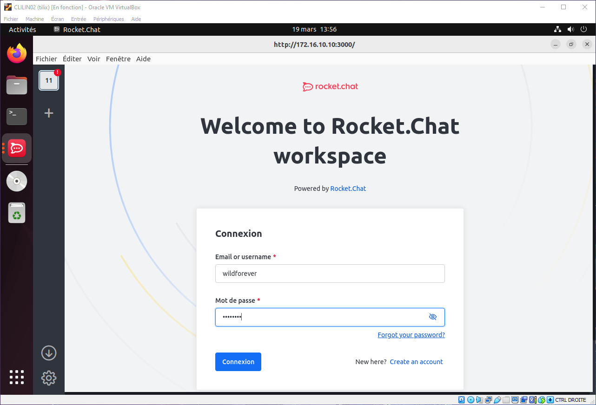
  
Une fois ces étapes complétées, vous serez connecté au **_Rocket.Chat_** de l'organisation.

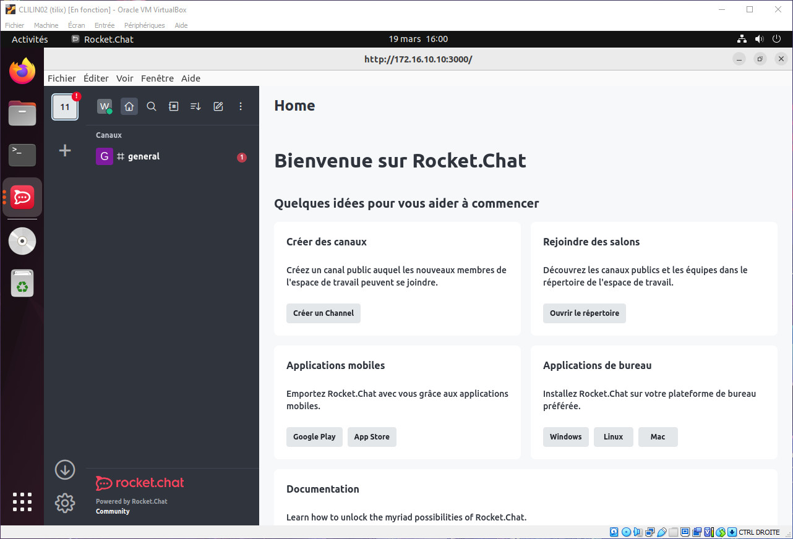

Vous découvrirez dans le prochain chapitre comment utiliser ce service de messagerie.

## **2. Découvrir les fonctionnalités de Rocket.Chat**

### **Le Profil**

Nous allons commencer par vous présenter comment personnaliser votre Profil

Cliquez tout d'abord sur la vignette de votre profil en haut à gauche de la fenêtre **_Rocket.Chat_**

Vous pouvez ici modifier votre statut (_en ligne_, _absent_, _occupé_, _hors ligne_ ou _personnalisé_)

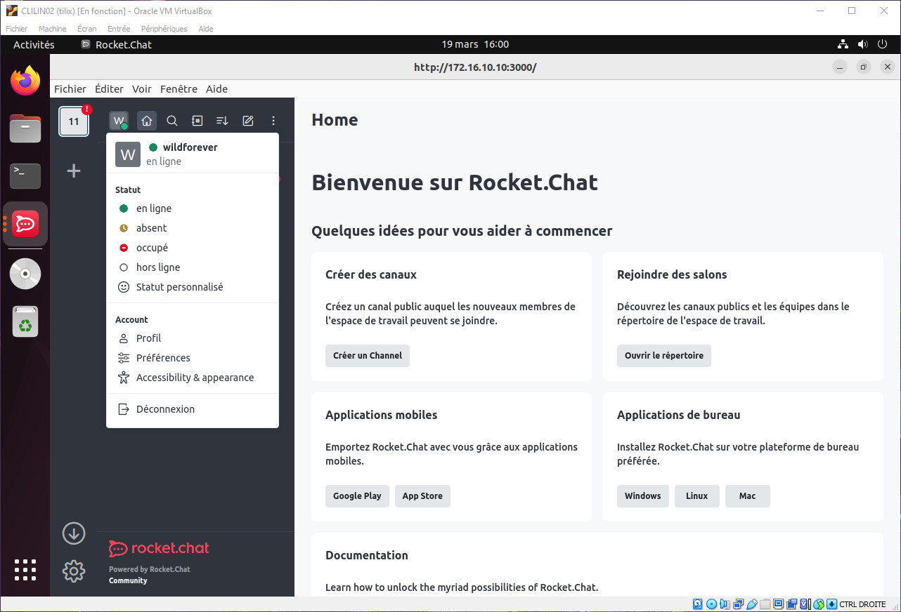

En cliquant sur _Profil_, vous accéderez au menu de personnalisation du profil

Vous pouvez modifier ici :

* Votre _Nom_ et votre _Nom d'utilisateur_

* Ajout d'un _Message de statut_ pour le statut en cours

* Ajout d'un _Surnom_

* Présentation via la _Bio_

* Votre adresse _E-mail_

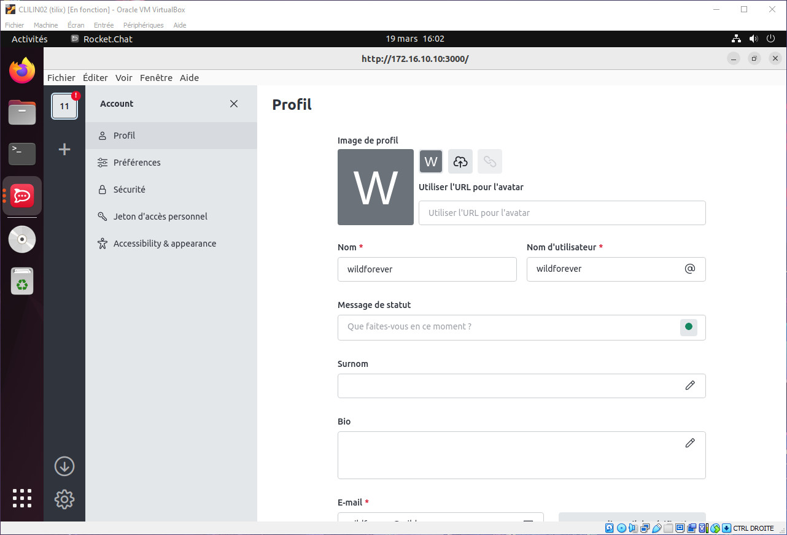

Pour changer votre mot de passe, veuillez vous rendre dans l'onglet _Sécurité_

Vous pouvez également activer l'_Authentification à deux facteurs_

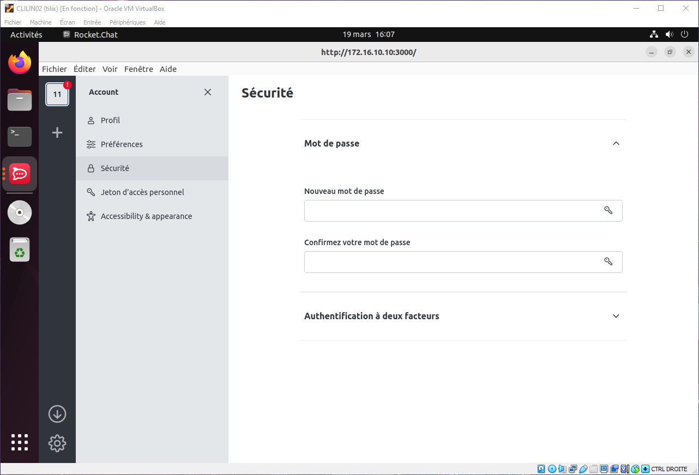

### **Les fonctionnalités**

**_Rocket.Chat_** est un service de messagerie organisé en système de canaux (ou channels) publics ou privés, un service de messagerie privé est également intégré.

Vous pouvez rejoindre des canaux existants ou en créer de nouveaux, certains canaux peuvent être privés (seuls certains membres auront accés à ceux-ci)

Cliquez sur _Create Channel_ pour en créer un, ou bien sur _Open directory_ pour afficher la liste des canaux

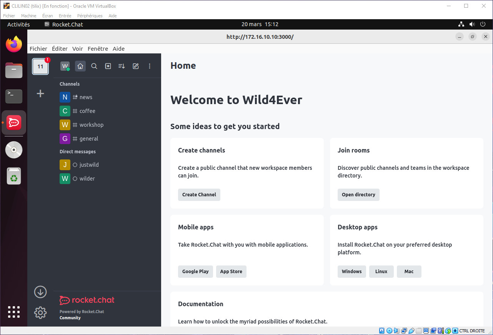

Dans le cas où vous souhaitez créer un canal, vous devrez renseigner plusieurs champs et options

* Le _Nom de canal_ qui est obligatoire (faites court et concis)

* Le _Sujet_ du canal (optionnel)

* Option -Private_ à activer si vous souhaitez rendre le canal privé

* Option _Read only_ à activer si vous souhaitez mettre le canal en lecture seule 

* Option _Broadcast_, c'est un dérivé du Read only, mais les membres peuvent répondre aux messages

* Vous pouvez ajouter directement des membres à la création du canal

Certaines options sont désactivées comme _Federated_ ou _Encrypted_ en fonction des droits d'administration

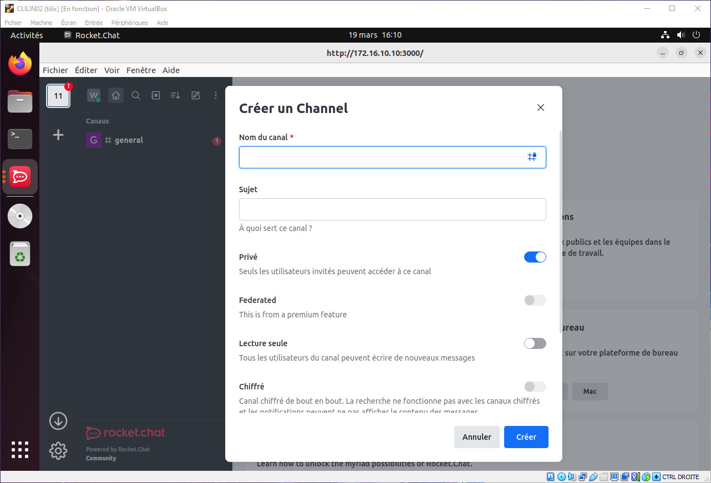

Lorsque vous souhaitez rejoindre un cana via _open directory_

Vous pouvez ici rejoindre directement un canal existant parmi la liste, attention toutefois, si l'un des canaux contient un cadenas dans le #, il s'agit d'un canal privé, vous devrez demander l'accés à un personne qui a les droits sur le canal

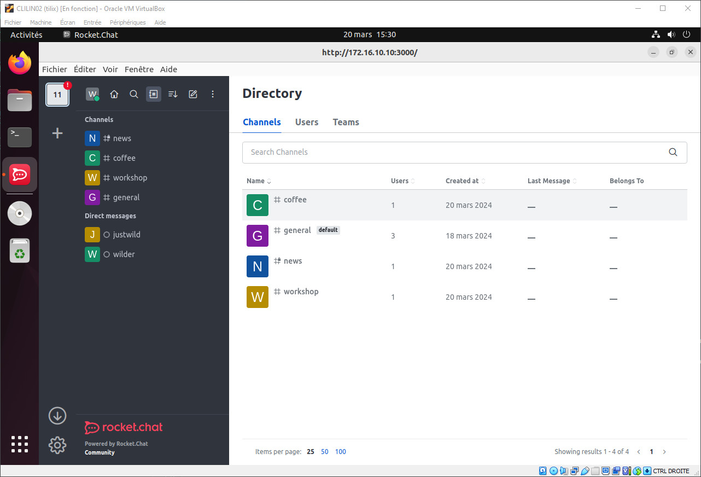

Vous pouvez aussi contacter directement un membre par message privé en cliquant sur l'onglet _Users_

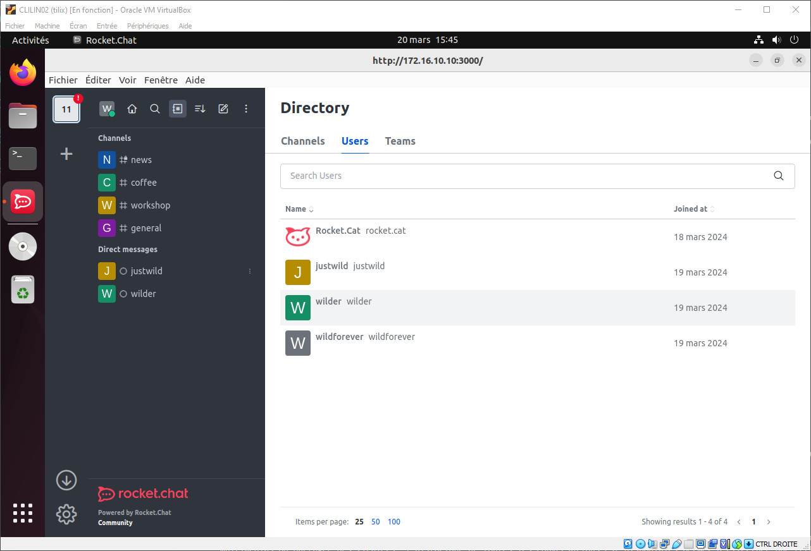

Voici pour les fonctionnalités de bases de **_Rocket.Chat_**

Pour résumer, **_Rocket.Chat_** est un service de messagerie instantanée qui vous permettra de discuter individuellement ou en groupe, vous pourrez ajouter des contenus multimedias ou partager des fichiers, l'historique de toutes les conversations est disponibles et permet d'effectuer une recherche avancée

Ce service est aussi interactif, vous pouvez exprimer des réactions aux messages ou encore mettre un emoji parmi la variété d'émoticônes disponibles prédéfinies

Le principe du canal thématique permet une collaboration efficace. Un large éventail d'outils et de services tiers est disponible, tels que les outils de gestion de projets, les plateformes de stockage cloud, les services de vidéoconférence.

Les mentions permettent aux utilisateurs d'attirer l'attention de leurs collègues sur des messages importants, tandis que les notifications personnalisables garantissent que les membres de l'équipe restent informés des activités pertinentes, même lorsqu'ils sont hors ligne. 

## **3. Améliorer votre expérience en personnalisant les options**

Afin d'optimiser votre expérience sur **_Rocket.Chat_**, différentes options s'offrent à vous dans l'onglet _Préférences_

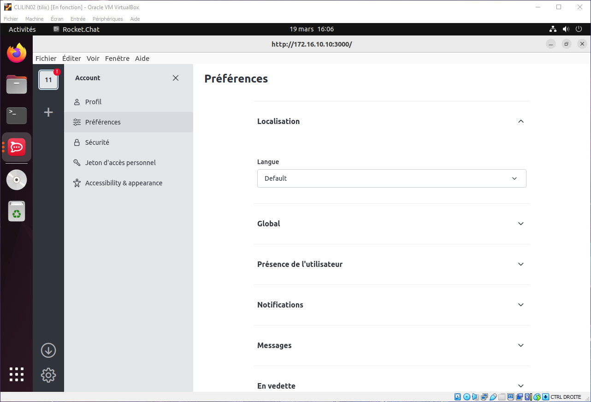

Il existe un système de notification par canal, vous pouvez également bénéficier de paramètres de notifications personnalisés

Il existe également des extensions disponibles sur le _Marketplace_ interne, celui-ci regroupe un grand nombre de modules complémentaires

C'est à vous d'explorer toutes les possibilités qu'offre **_Rocket.Chat_** 

## **4. Administration du serveur intégrée dans le logiciel**

Cette section nécessite les droits d'administration, elle n'est nullement destinée aux simples utilisateurs.

Dans la section Administration, vous pourrez gérer les canaux, les membres et bien d'autres options

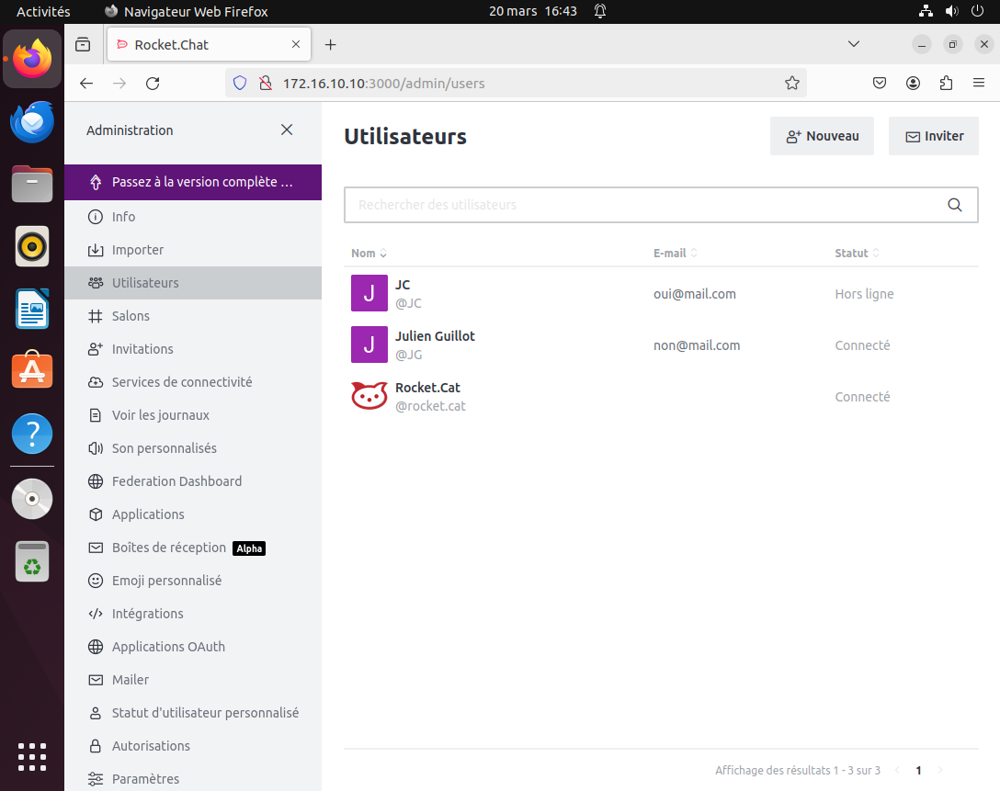

En cliquant sur l'onglet _Utilisateurs_, vous pouvez ajouter directement des membres en remplissant tous les champs demandés, vous avez possibilité d'envoyer un email de bienvenu pour prévenir le membre de son ajout.

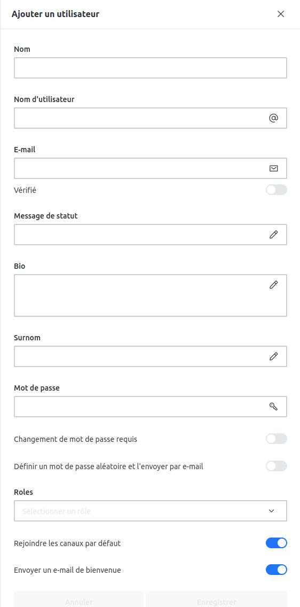

En cliquant sur l'onglet _Emoji personnalisé_

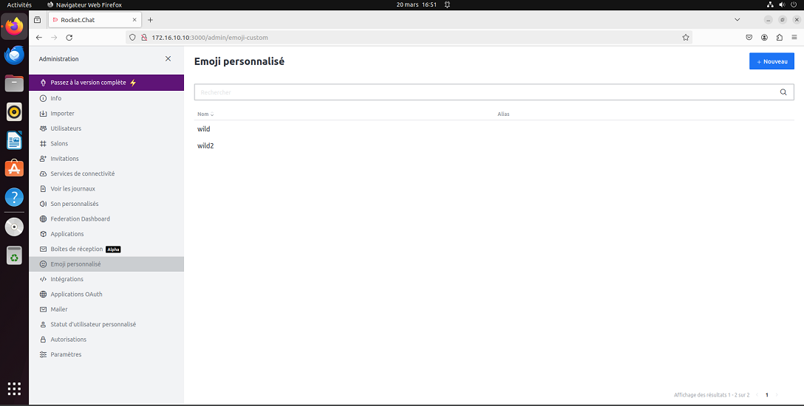

Vous pouvez ajouter des émoticônes que vous aurez préalablement dans votre ordinateur, donnez leur un _Nom_, un _Alias_ (raccourci clavier) et importez-les sur le serveur en cliquant sur le "petit" bouton d'importation

D'autres fonctionnalités sont disponibles mais la plus grande tâche d'administration consiste à la gestion des canaux, des utilisateurs ainsi qu'aux mises à jour du serveur.

## **5. FAQ**

Où puis-je trouver de l'aide en cas de problème avec Rocket.Chat ?
>
>Si vous rencontrez des problèmes avec Rocket.Chat ou des questions, vous pouvez consulter la documentation officielle sur le site web de Rocket.Chat. De plus, la communauté Rocket.Chat est active et propose des forums de discussion, des groupes d'utilisateurs et d'autres ressources en ligne où vous pouvez poser des questions et obtenir de l'aide de la part d'autres utilisateurs et des développeurs de Rocket.Chat.
>

Rocket.Chat est-il adapté aux petites et grandes équipes ?
>
>Oui, Rocket.Chat convient aussi bien aux petites équipes qu'aux grandes organisations. Sa flexibilité permet de s'adapter à différents besoins en communication et de collaboration, que ce soit pour une petite équipe de projet ou pour une entreprise de grande envergure.
>

Comment puis-je garantir la confidentialité des conversations sur Rocket.Chat ?
>
>Rocket.Chat propose des options de confidentialité avancées, y compris le chiffrement des communications, les contrôles d'accès granulaires, la gestion des données personnelles et des paramètres de confidentialité personnalisables pour protéger la confidentialité des conversations et des données des utilisateurs.
>

Est-ce que Rocket.Chat offre des options de sauvegarde et de restauration des données ?
>
>Oui, Rocket.Chat offre des options de sauvegarde et de restauration des données pour garantir la sécurité et la disponibilité des informations critiques. Vous pouvez configurer des sauvegardes régulières et des plans de continuité des activités pour prévenir la perte de données.
>

Est-ce que Rocket.Chat offre une assistance en plusieurs langues ?
>
>Oui, Rocket.Chat prend en charge plusieurs langues et offre une interface multilingue pour répondre aux besoins des utilisateurs du monde entier. Vous pouvez sélectionner votre langue préférée dans les paramètres de votre compte utilisateur.
>

Est-ce que Rocket.Chat offre des options de gestion des utilisateurs ?
>
>Oui, Rocket.Chat propose des fonctionnalités de gestion des utilisateurs telles que la création de comptes d'utilisateur, la gestion des rôles et des autorisations, ainsi que la possibilité de configurer des équipes et des canaux spécifiques pour différents groupes d'utilisateurs.
>

Rocket.Chat prend-il en charge les appareils mobiles ?
>
>Oui, Rocket.Chat propose des applications mobiles disponibles sur les plateformes iOS et Android. Ces applications offrent une expérience utilisateur optimisée pour les appareils mobiles, vous permettant de rester connecté et de collaborer avec votre équipe où que vous soyez.
>
> 
>

Rocket.Chat offre-t-il une assistance en temps réel pour les utilisateurs ?
>
>Oui, Rocket.Chat propose une assistance en temps réel via différents canaux tels que la messagerie instantanée, les forums de discussion et les tickets d'assistance. L'équipe de support est disponible pour répondre à vos questions et résoudre vos problèmes rapidement.
>

Rocket.Chat propose-t-il des options de traduction automatique ?
>
>Oui, Rocket.Chat intègre des outils de traduction automatique pour faciliter la communication entre les utilisateurs de différentes langues. Cela permet une collaboration efficace et transparente au sein d'équipes multilingues.
>