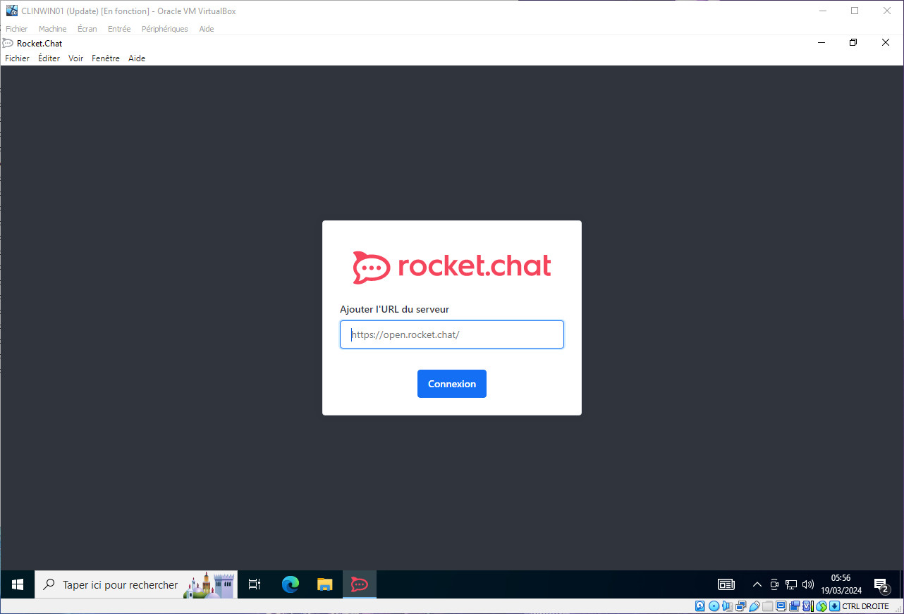
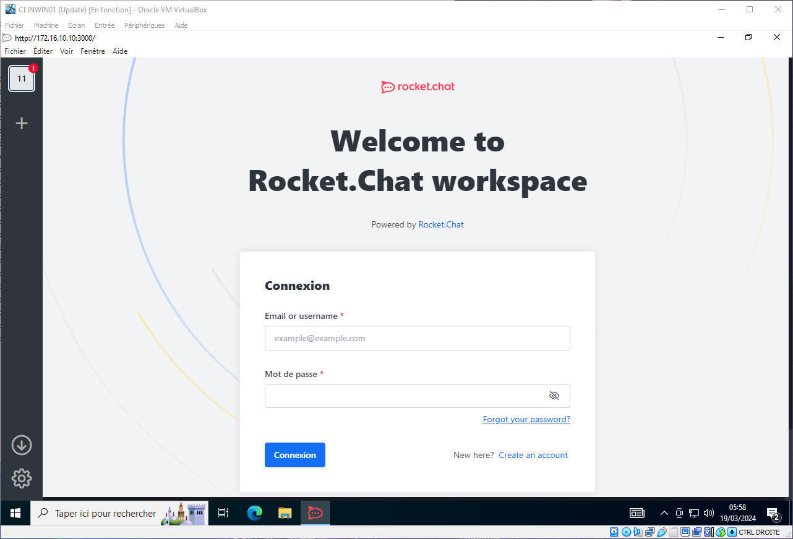

# Implémentation d'un serveur de messagerie instantanée (chat)

Ce document est réservé à usage interne, il ne peut en aucun cas être divulgué à des tiers.

Dernière mise à jour du Document : **19 mars 2024**

## **Sommaire**

1. Démarrage et première connexion

2. Découvrir les fonctionnalités de RocketChat

3. Améliorer votre expérience en personnalisant les options

4. FAQ

## **1. Démarrage et première connexion**

Vous disposez désormais du logiciel **RocketChat** pour interagir avec vos collaborateurs et mener à bien vos différents projets.

Nous allons vous expliquer dans les étapes suivantes, le lancement du logiciel, ainsi qu'un accompagnement pour votre première connexion.

- Démarrage sous Ubuntu (Linux)

    Vous pouvez accéder au logiciel **RocketChat** via le Menu des applications

    

    Vous pourrez ajouter Zulip à vos _Favoris_ (Clic droit, puis Ajouter aux Favoris), afin que celui-ci apparaisse sur le côté droit de votre bureau.

    

    

- Démarrage sous Windows (Microsoft)

    Vous pouvez accéder au logiciel **Zulip**

    - soit via le raccourci créé sur le bureau de travail

        

    - soit en saisissant le nom du logiciel dans la barre de recherche Windows

        

Vous n'avez plus qu'à finaliser votre première connexion pour profiter pleinement de **RocketChat*.

Sachez également que RocketChat est disponible en version web, vous pouvez vous y rendre en vous connectant avec l'url de l'organisation (http://172.16.10.10:3000)

- Première connexion

    Les étapes de première connexion sont identiques aux deux Systèmes d'exploitation _Ubuntu_ & _Windows_.
    Il n'y aura par conséquent qu'une méthode expliquée.

    Une fois l'application démarrée, vous devrez ajouter l'url du serveur

    

    

    

    

    puis cliquez sur _Connexion_ pour arriver à la page de connexion utilisateur

    

    

    

    Une fois ces étapes complétées, vous serez connecté au **RocketChat** de l'organisation.

## **2. Découvrir les fonctionnalités de RocketChat**

## **3. Améliorer votre expérience en personnalisant les options**

## **4. FAQ**

- Je suis souvent en déplacement et j'ai besoin de me connecter à RocketChat sur mon Smartphone

    >
    >RocketChat est disponible pour les mobiles
    >
    >Vous pouvez aller télécharger les versions mobiles en passant par l'url [https://www.rocket.chat/download-apps](https://www.rocket.chat/download-apps)
    >
    >Ou bien en cliquant directement sur les vignettes ci-dessous
    >
    >
    >
    >
    >

