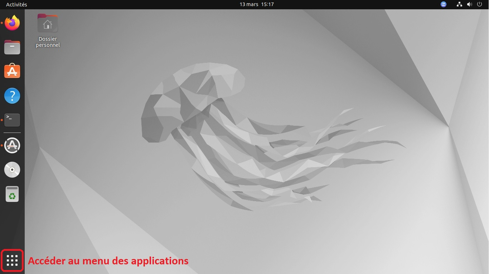
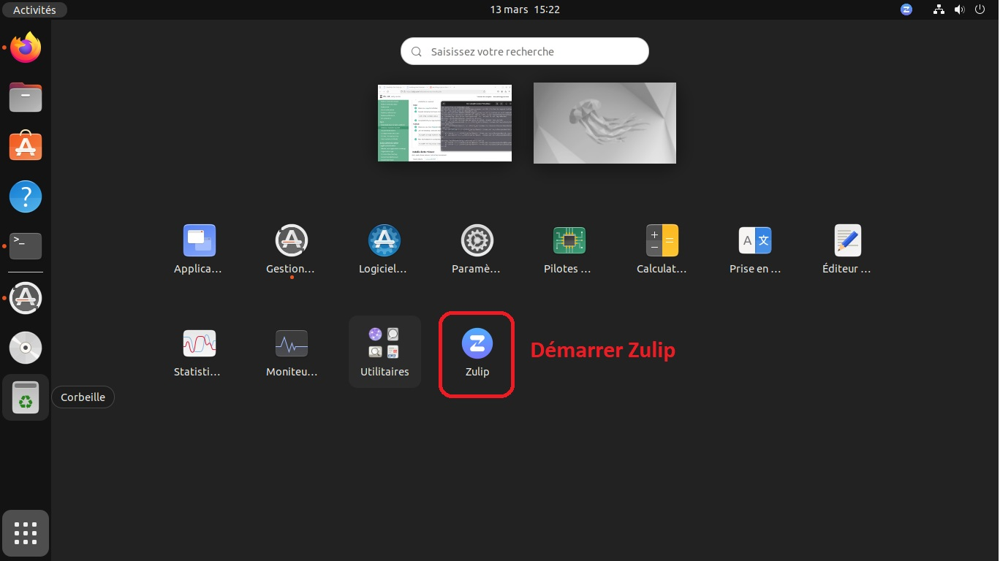
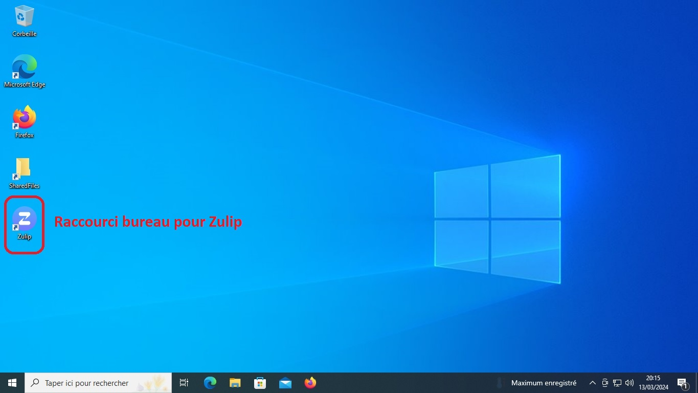
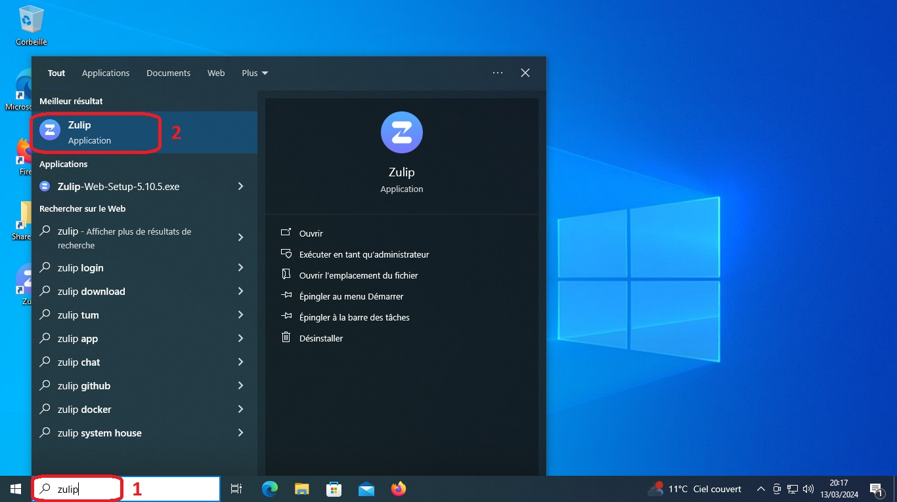

# Implémentation d'un serveur de messagerie instantanée (chat)

## **Sommaire**

1. Démarrage et première connexion

2. Découvrir les fonctionnalités de Zulip

3. Améliorer votre expérience en personnalisant les options

4. FAQ

## **1. Démarrage et première connexion**

Vous disposez désormais du logiciel **Zulip** pour interagir avec vos collaborateurs et mener à bien vos différents projets.

Nous allons vous expliquer dans les étapes suivantes, le lancement du logiciel, ainsi qu'un accompagnement pour votre première connexion.

- Démarrage sous Ubuntu (Linux)

    Vous pouvez accéder au logiciel **Zulip** via le Menu des applications

    

    

    Vous pourrez ajouter Zulip à vos _Favoris_ (Clic droit, puis Ajouter aux Favoris), afin que celui-ci apparaisse sur le côté droit de votre bureau.

- Démarrage sous Windows (Microsoft)

    Vous pouvez accéder au logiciel **Zulip**

    - soit via le raccourci créé sur le bureau de travail

        

    - soit en saisissant le nom du logiciel dans la barre de recherche Windows

        

Vous n'avez plus qu'à finaliser votre première connexion pour profiter pleinement de **Zulip**.

Les étapes de première connexion sont identiques aux deux Systèmes d'exploitation _Ubuntu_ & _Windows_.

## **2. Découvrir les fonctionnalités de Zulip**

## **3. Améliorer votre expérience en personnalisant les options**

## **4. FAQ**

